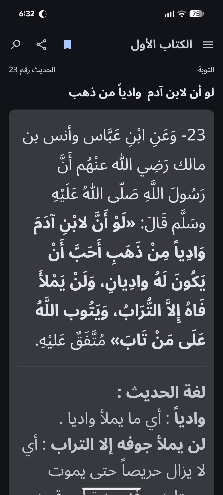
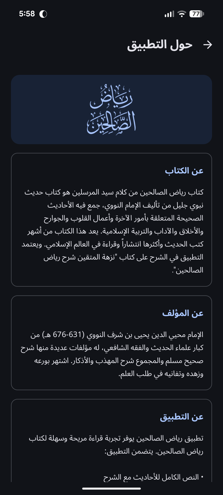
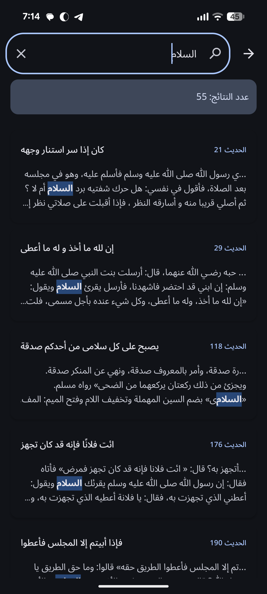

# Riyad as-Salheen - Android App

Riyad as-Salheen (The Gardens of the Righteous) is an Android application designed for reading, searching, and bookmarking Hadiths from the famous book by Imam al-Nawawi. The app provides a modern, user-friendly interface with support for explanations (Sharh) and advanced search capabilities.

## 📱 Screenshots
*(Place screenshots here during production)*
| Home | About | Search | Bookmarks
| :---: | :---: | :---: | :---: |
|  |  |  |  |

## ✨ Features
- **Browse & Read:** Navigate through the books and doors (chapters) of Riyad as-Salheen with ease.
- **Search with Normalization:** Advanced search that removes Arabic diacritics (tashkeel) for more accurate results.
- **Bookmarks:** Save your favorite Hadiths for quick access later.
- **Hadith Explanations:** Read detailed Sharh for a deeper understanding of the Hadiths.
- **Customization:** Adjustable font sizes and support for dark/light modes.
- **Offline Access:** All content is stored locally in a pre-packaged SQLite database.

## 🛠️ Tech Stack & Architecture
- **Language:** Kotlin
- **UI Framework:** Jetpack Compose (Material 3)
- **Architecture Pattern:** MVVM (Model-ViewModel-Repository)
- **Navigation:** Navigation Compose
- **Local Storage:** SQLite (pre-populated database)
- **Preferences:** DataStore Preferences
- **Build System:** Gradle (Kotlin DSL) with Version Catalogs

## 📂 Project Structure
- `app/`: The main Android application module.
- `app/src/main/assets/databases/`: Contains the `riyad_salheen.db` SQLite database.
- `dp_update/`: Python-based utility for database maintenance and text processing.
- `gradle/`: Dependency management using version catalogs (`libs.versions.toml`).

## 🚀 Getting Started

### Prerequisites
- [Android Studio Ladybug](https://developer.android.com/studio) or newer.
- JDK 11 (used for builds).
- Android SDK 36 (compileSdk).
- Min SDK 24.

### Build & Run
1. Clone the repository:
   ```bash
   git clone https://github.com/1992please/riyad-alsalheen.git
   ```
2. Open the project in Android Studio.
3. Build the project using the Gradle wrapper:
   - **Build Debug APK:** `./gradlew assembleDebug`
   - **Run Unit Tests:** `./gradlew testDebugUnitTest`
4. Deploy the app to an emulator or physical device.

### Database Maintenance (Python)
The `dp_update` folder contains a script for processing Hadith text (e.g., removing HTML, normalizing search text).
1. Navigate to `dp_update/`.
2. Install Python 3.
3. Run the script: `python main.py`.

## 📄 License
This project is for personal use and educational purposes. *(Add specific license details if applicable)*

---
Developed by [Nader Hegazy](https://nadernour.github.io/)
